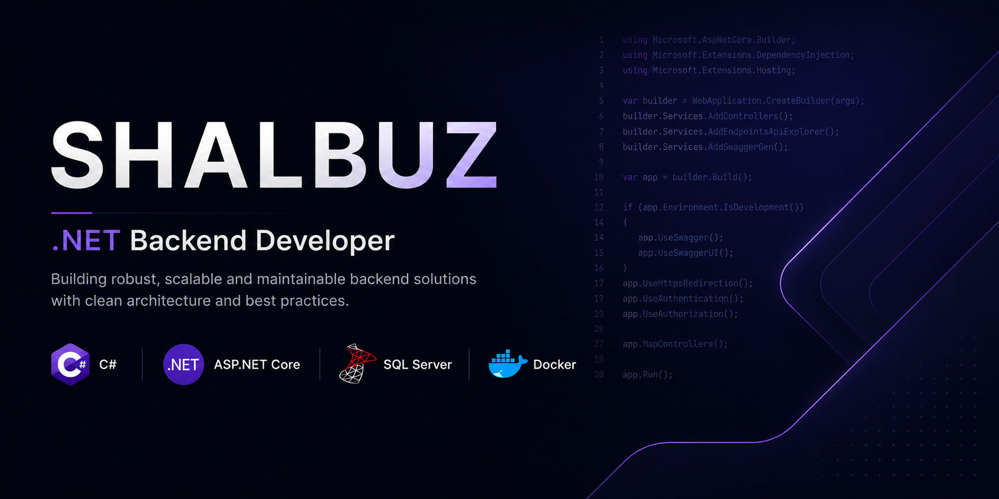

  

  

<h1 align="center">
Hi 👋, I'm Shalbuz
</h1>

<h3 align="center">
Junior .NET Backend Developer from Azerbaijan 🇦🇿
</h3>

## 💻 About Me

I'm an Junior .NET Backend Developer from Azerbaijan.

I enjoy building backend applications with C# and ASP.NET Core while continuously improving my software engineering skills.

- 🌱 Currently learning: Clean Architecture, Docker, Azure
- 💼 Looking for: .NET Trainee / Junior opportunities
- 🎯 Goal: Build scalable and maintainable backend applications

## ⚒️ Languages & Tools

  
  
  
  
  
  
  
  

## 📌 Featured Projects

Coming soon...

## 🌐 Connect with me

  
  &nbsp;&nbsp;

  
  &nbsp;&nbsp;

  

  
## 📊 GitHub Stats

  
  

